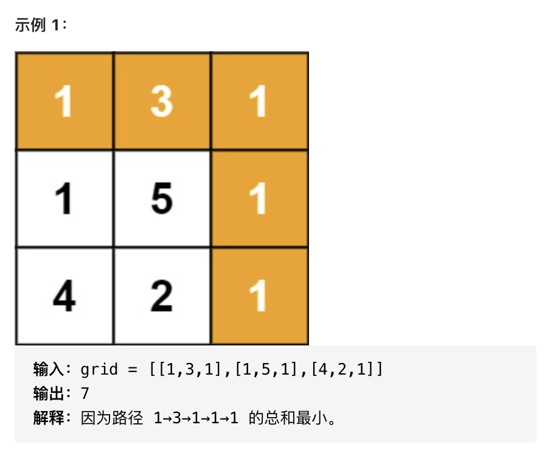

> 动态规划（Dynamic programming，简称 DP）
### 介绍
动态规划是一种将复杂问题分解成更小的子问题来解决的优化技术，常常适用于有重叠子问题和最优子结构性质的问题。
基本思想非常简单：若要解一个给定问题，我们需要解其不同部分（即子问题），再根据子问题的解以得出原问题的解。
它的优势是具有**天然剪枝的功能，从而减少计算量**。

### 解题步骤
1. 定义子问题
2. 找出子问题之间的依赖关系，即状态转移方程
3. 识别基线条件

### 小试牛刀
我们按照上述的思路来看一道具体的题目：[最小路径和](https://leetcode-cn.com/problems/minimum-path-sum/)

- 问题<br>
给定一个包含非负整数的 `m x n` 网格 `grid` ，请找出一条从左上角到右下角的路径，使得路径上的数字总和为最小。<br>
说明：每次只能向下或者向右移动一步。<br>


- 思路
    1. 定义子问题<br>
    我们用 `dp[i][j]` 表示从左上角出发到 `(i,j)` 位置的最小路径和
    2. 找出子问题之间的依赖关系，即状态转移方程<br>
        - 对于第一行元素来说，只能从左上角元素开始向右移动到达。<br>
          因此转移方程为 `dp[0][j] = dp[0][j−1] + grid[0][j]`
        - 对于第一列元素来说，只能从左上角元素开始向下移动到达。<br>
          因此转移方程为 `dp[i][0] = dp[i−1][0] + grid[i][0]`
        - 对于其他元素来说，可以从其上方相邻元素向下移动一步到达，或者从其左方相邻元素向右移动一步到达。因此，对应的最小路径和等于其上方相邻元素与其左方相邻元素两者对应的最小路径和中的最小值加上当前元素的值。<br>
        转移方程为 `dp[i][j] = min(dp[i−1][j], dp[i][j−1]) + grid[i][j]`
    3. 识别基线条件<br>
        显而易见 `dp[0][0] = grid[0][0]`，问题的解为 `dp[m-1][n-1]`

- 具体实现
    ```js
    var minPathSum = function(grid) {
        const rows = grid.length
        const columns = grid[0].length
        const dp = []
        for(let i = 0; i < rows; i++) {
            dp[i] = new Array(columns)
        }
        dp[0][0] = grid[0][0]

        // 第一行
        for(let i = 1; i < columns; i++) {
            dp[0][i] = dp[0][i-1] + grid[0][i]
        }

        // 第一列
        for(let i = 1; i < rows; i++) {
            dp[i][0] = dp[i-1][0] + grid[i][0]
        }
        // 其他行列
        for(let i = 1; i < rows; i++) {
            for(let j = 1; j < columns; j++) {
                dp[i][j] = Math.min(dp[i-1][j], dp[i][j-1]) + grid[i][j]
            }
        }
        return dp[rows-1][columns-1]
    }
    ```
    时间复杂度：$O(mn)$，其中 m 和 n 分别是网格的行数和列数，需要对整个网格遍历一次，计算 dp 的每个元素的值。<br>
    空间复杂度：$O(mn)$，其中 m 和 n 分别是网格的行数和列数，创建一个二维数组 dp，和网格大小相同。
### 推荐题目
- 简单
    - [70.爬楼梯](https://leetcode-cn.com/problems/climbing-stairs/)  
- 中等
    - [64.最小路径和](https://leetcode-cn.com/problems/minimum-path-sum/)
    - [62.不同路径](https://leetcode-cn.com/problems/unique-paths/)
    - [221.最大正方形](https://leetcode-cn.com/problems/maximal-square/)
    - [300.最长递增子序列](https://leetcode-cn.com/problems/longest-increasing-subsequence/)
    - [322.零钱兑换](https://leetcode-cn.com/problems/coin-change/)
    - [91.解码方法](https://leetcode-cn.com/problems/decode-ways/)
### 更多文章
- [力扣加加](https://leetcode-solution-leetcode-pp.gitbook.io/leetcode-solution/)
- [leetcode-动态规划](https://leetcode-cn.com/tag/dynamic-programming/)

