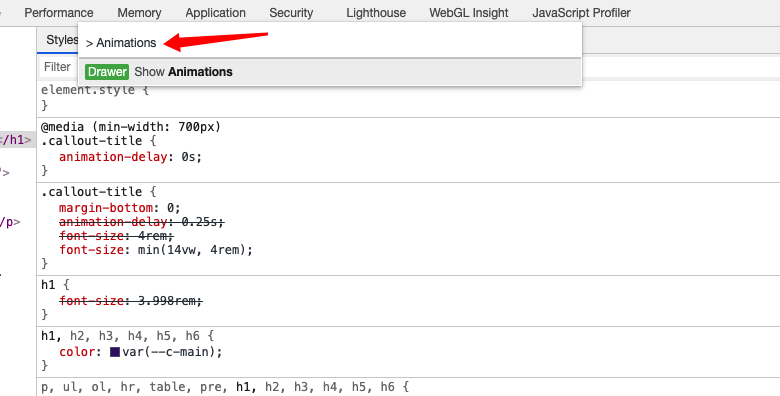
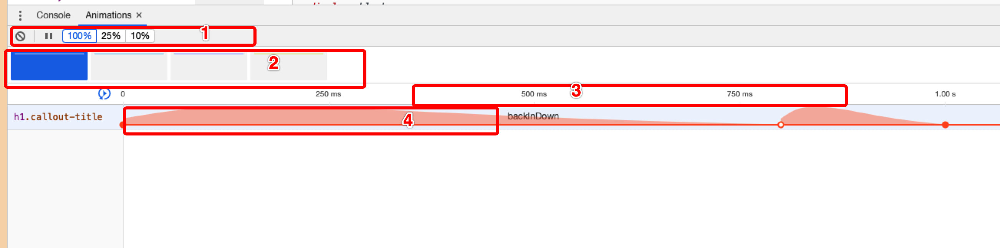

### 动画检查器

#### 用途
- 检查动画：慢速播放、重播或检查动画组的源代码

- 修改动画：修改动画组的时间、延迟、持续时间或关键帧偏移

#### 如何使用

1. 打开[命令行](./readme.md)，输入Animations，选择Show Animations，打开动画检查器

    

2. 打开动画检查器之后，在页面发生的动画就会被其捕获，我以[animate](https://animate.style/)为例。打开网页之后点击，backInDown，backInLeft，backInRight，backInUp，动画检查器就会自动捕获这四种动画

    

    图中共分四个区域，1为控制动画的速度和播放；2为捕获的动画；3为动画的时间线；4为动画的实现细节。

    我们可以在这里实现动画的修改和检查等操作。

### 参考文章
- [检查动画](https://developers.google.com/web/tools/chrome-devtools/inspect-styles/animations?hl=zh-cn)