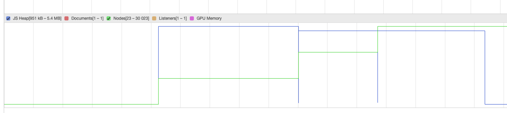
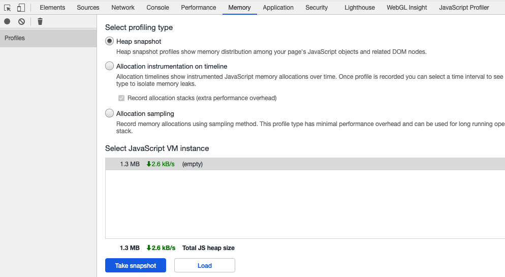
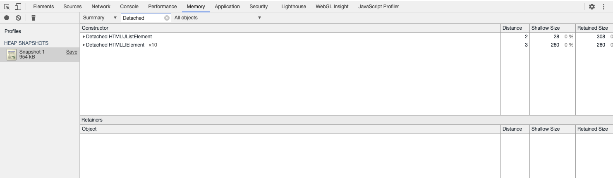
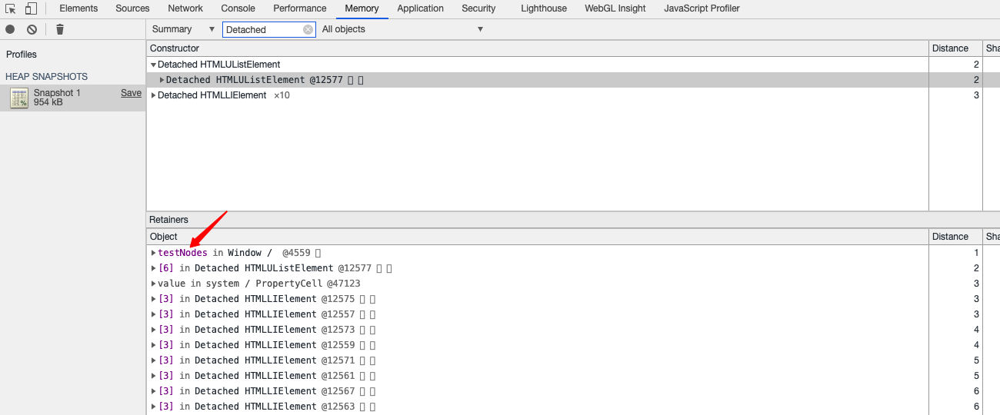

### 使用 Chrome 任务管理器实时监视内存使用

1. 打开任务管理器，主菜单-->>更多工具-->>任务管理器

2. 右键点击任务管理器的表格标题并启用 JavaScript 内存。

3. 与内存相关的有两列，内存和JavaScript 内存。
   - 内存 列表示原生内存。

   - JavaScript 内存 列表示 JS 堆。此列包含两个值。 您感兴趣的值是实时数字（括号中的数字）。 实时数字表示您的页面上的可到达对象正在使用的内存量。

### 使用 Timeline 记录可视化内存泄漏

#### 测试代码

```js
var x = [];

function grow() {
  for (var i = 0; i < 10000; i++) {
    document.body.appendChild(document.createElement('div'));
  }
  x.push(new Array(1000000).join('x'));
}

document.getElementById('grow').addEventListener('click', grow);

```

#### 分析

1. 在 DevTools 上打开 Performance 面板，勾选Memory选项。

2. 开始记录，一种比较好的做法是使用强制垃圾回收开始和结束记录。

    


    绿色的代表节点计数器，蓝色的代表JS堆，我们可以看到节点数目随着我们点击按钮是逐渐升高的；JS 堆在结束时会比开始大。这种情况可能就存在内存泄漏现象，需要我们关注。
    
### 使用堆快照发现已分离 DOM 树的内存泄漏

#### 分离节点

只有页面的 DOM 树或 JavaScript 代码不再引用 DOM 节点时，DOM 节点才会被作为垃圾进行回收。 如果某个节点已从 DOM 树移除，但某些 JavaScript 仍然引用它，我们称此节点为“已分离”。
已分离的 DOM 节点是内存泄漏的常见原因。

#### 测试代码

```js
var testNodes;

function create() {
  var ul = document.createElement('ul');
  for (var i = 0; i < 10; i++) {
    var li = document.createElement('li');
    ul.appendChild(li);
  }
  testNodes = ul;
}

document.getElementById('create').addEventListener('click', create);

```

#### 分析

堆快照可以为您显示拍摄快照时内存在您页面的 JS 对象和 DOM 节点间的分配。

1. 打开devtool并转到memory面板，选择 Heap Snapshot 单选按钮，然后按 Take Snapshot 按钮创建快照。

    

2. 快照完成后，从左侧面板中选择该快照，在 Class filter 文本框中键入 Detached，搜索已分离的 DOM 树。

    

3. 点击对应的树，在Object我们可以看到详细的信息，比如是被哪段代码引用的，示例中是testNodes。我们需要做的就是当使用 testNodes 的代码确保在不需要时，此代码可以移除其对节点的引用。

    

### 参考文章
- [memory](https://developers.google.com/web/tools/chrome-devtools/memory-problems?hl=zh-cn#top_of_page)