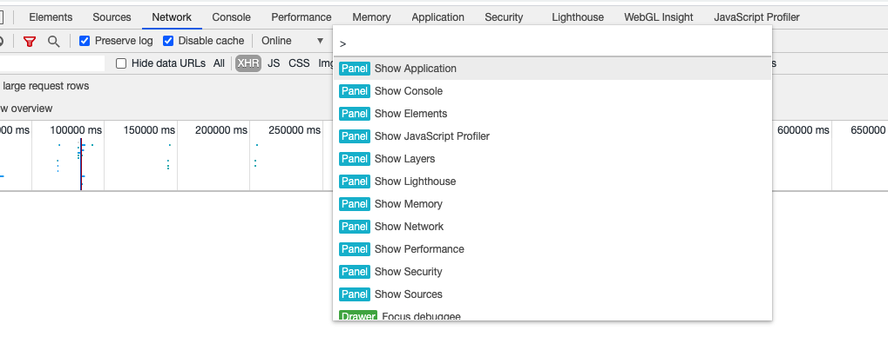
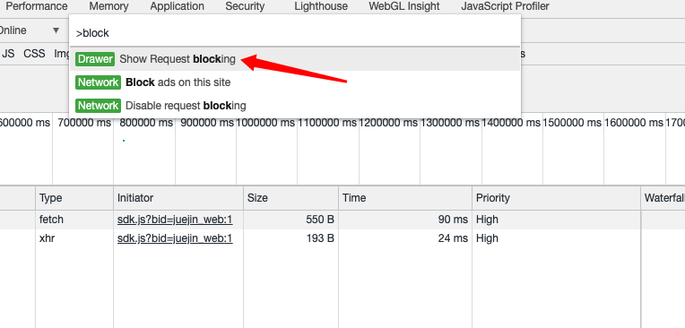
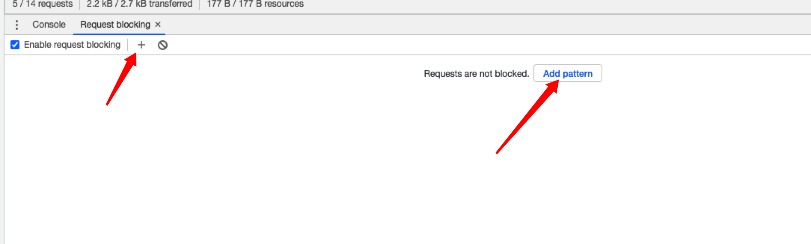
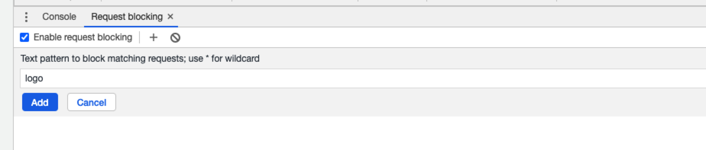
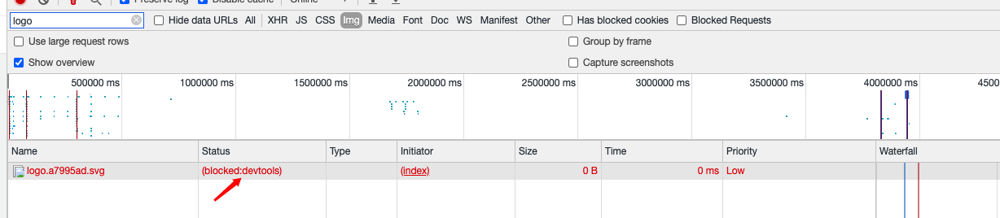

### Block requests
该功能可以让我们模拟某些文件或请求失败的场景
1. 开启命令行

    

2. 输入block，选择Show Request Blocking

    

3. 点击 Add Pattern.

    

4. 输入你要block的文件或者请求，点击添加

   例如以掘金首页为例，我们可以block首页的logo

   

5. 重新reload页面，会发现我们刚才输入的文件会请求失败

    

### 参考文章
- [Block requests](https://developers.google.com/web/tools/chrome-devtools/network?hl=zh-cn)