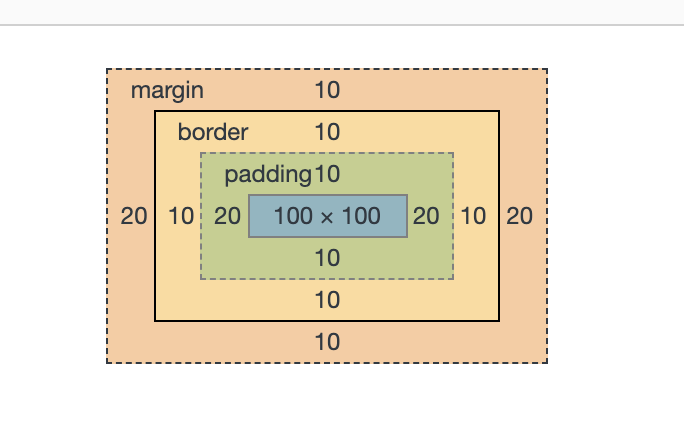

### 概念
所有HTML元素可以看作盒子，它包括：外边距（margin），边框（border），内边距（padding），和实际内容（content）。

### 标准盒模型（W3C）
- 我们设置的width/height是盒子实际内容（content）的宽高，不包含边框和内边距

```css
.box {
    width: 100px;
    height: 100px;
    padding: 10px 20px;
    border: 10px solid red;
    margin: 10px 20px;
}
```




### 怪异盒子模型（IE）
- 我们设置的width/height是盒子实际内容（content）的宽高 + 内边距 + 边框

```css
.box {
    width: 100px;
    height: 100px;
    padding: 10px 20px;
    border: 10px solid red;
    margin: 10px 20px;
}
```


### 指定盒子模型
`box-sizing`属性可以让我们指定盒模型种类
- `content-box` 即标准盒模型
- `border-box`  即怪异盒模型
